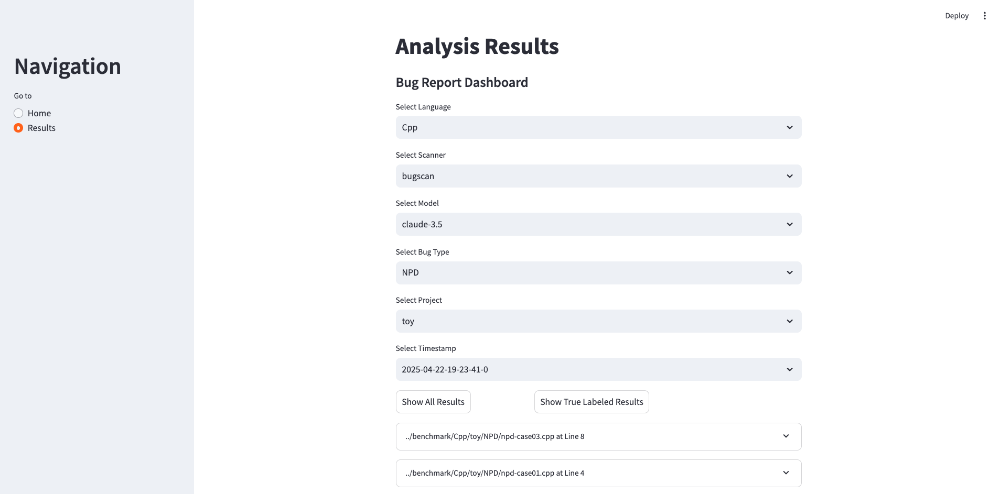
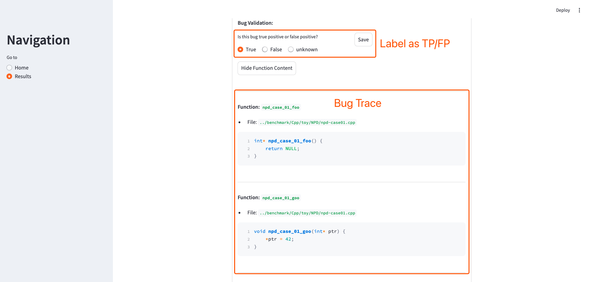

# User Guide

## Installation

1. Create and activate a conda environment with Python 3.9.18:

   ```sh
   conda create -n repoaudit python=3.9.18
   conda activate repoaudit
   ```

2. Install the required dependencies:

   ```sh
   cd RepoAudit
   pip install -r requirements.txt
   ```

3. Ensure you have the Tree-sitter library and language bindings installed:

   ```sh
   cd lib
   python build.py
   ```

4. Configure the OpenAI API key. 

   ```sh
   export OPENAI_API_KEY=xxxxxx >> ~/.bashrc
   ```

   For Claude3.5, we use the model hosted by Amazon Bedrock. If you want to use Claude-3.5 and Claude-3.7, you may need to set up the environment first.


## Quick Start

1. We have prepared several benchmark programs in the `benchmark` directory for a quick start. Some of these are submodules, so you may need to initialize them using the following commands:

   ```sh
   cd RepoAudit
   git submodule update --init --recursive
   ```

2. We provide the script `src/run_repoaudit.sh` to run different types of scans. You can use the following command to look up how to run `run_repoaudit.sh`.

    ```sh
    cd src
    bash run_repoaudit.sh --help
    ```

   Here are some example commands:

   ```sh
   # For data flow-based scanning (dfbscan)
   bash run_repoaudit.sh dfbscan --language Java --project-path ../benchmark/Java/toy --bug-type NPD --is-reachable

   # For general bug scanning (bugscan)
   bash run_repoaudit.sh bugscan --language Java --project-path ../benchmark/Java/toy --is-iterative

   # For debug scanning (debugscan)
   bash run_repoaudit.sh debugscan --language Java --project-path ../benchmark/Java/toy
   ```

3. After the scanning is complete, the results will be available in JSON format and log files.


## Parallel Auditing Support

For a large repository, a sequential analysis process may be quite time-consuming. To accelerate the analysis, you can choose parallel auditing. Specifically, you can set the option `--max-neural-workers` to a larger value. By default, this option is set to 6 for parallel auditing.
Also, we have set the parsing-based analysis in a parallel mode by default. The default maximal number of workers is 10.

## User Interface

### CLI

When scanning the code repository using DFBScanAgent, we can specify the analysis request in the command line.
Specifically, RepoAudit can support three modes, namely file-level, directory level, and repository-level code auditing.
In the command line interface, the users are required to specify the names of files or directories, or just specify the request of scanning the whole repository, along with the bug type. An example is as follows.

```
> bash run_repoaudit.sh bugscan
Parsing files: 100%|██████████████████████████████████████████████████████████████████████████████████████████████████████████| 6/6 [00:00<00:00, 3561.03it/s]
Analyzing functions: 100%|█████████████████████████████████████████████████████████████████████████████████████████████████| 24/24 [00:00<00:00, 10248.76it/s]
Analyzing call graphs: 100%|███████████████████████████████████████████████████████████████████████████████████████████████| 24/24 [00:00<00:00, 18738.51it/s]
Extracting seeds: 100%|███████████████████████████████████████████████████████████████████████████████████████████████████████| 24/24 [00:00<00:00, 84733.41it/s]
2025-04-24 17:51:17,152 - INFO - Please enter your analysis request:
> I want to detect all the Null Pointer Derference bugs in the files `NPD/TestCase1.cpp` and `NPD/TestCase2.cpp`.
```

Here, the paths of the specified files or directories should be relative paths with respect to the root path of the the whole repository.

### Web UI

We also provide a web interface to assist the users in checking bug reports generated by RepoAudit.
You can execute the following commands to start the Web UI.

```
> cd RepoAudit
> streamlit run src/web_ui.py

Collecting usage statistics. To deactivate, set browser.gatherUsageStats to false.

  You can now view your Streamlit app in your browser.

  Local URL: http://localhost:8505
  Network URL: http://10.145.21.28:8505
  External URL: http://128.210.0.165:8505
```

Open the webpage via one of the above links. You will see the following UI page.



By clicking each bug report, you can further examine the functions in the bug trace and the LLM-generated explanation.
Lastly, we can classify it into TP/FP/Unknown and the labled results are stored locally in your machine.




